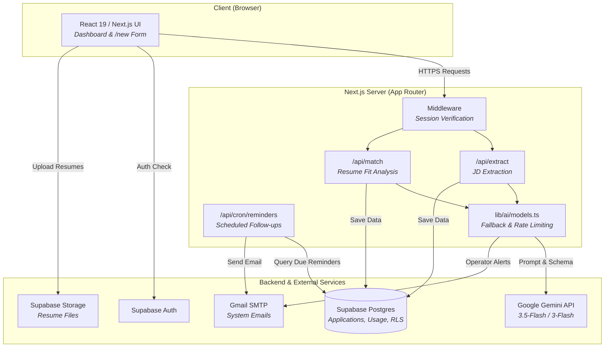
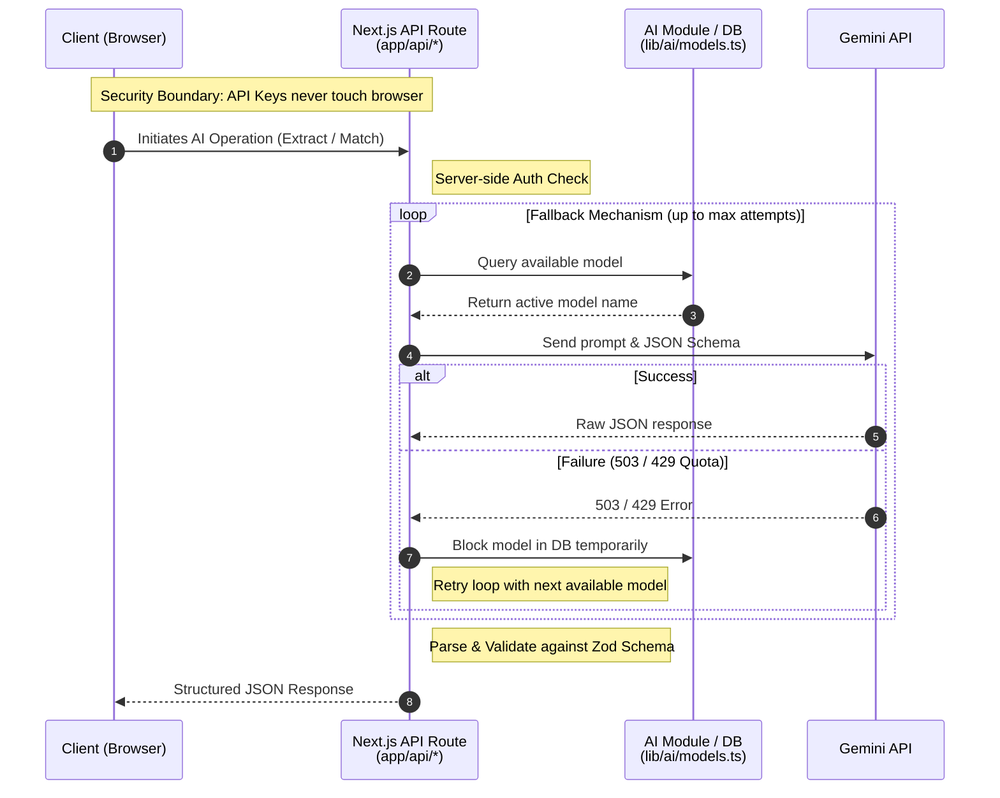

# Uppend

**Try it live:** [https://mkro-uppend.vercel.app](https://mkro-uppend.vercel.app)

AI-powered job application tracker that turns a pasted job posting into a structured, trackable application — complete with an AI-generated fit assessment against your resume.

Built to solve a real problem from my own job search: manually re-typing job postings into a spreadsheet, then guessing whether a role is actually worth applying to, is tedious and error-prone. Uppend automates both.


## What it does

*   **No signup required** — jump straight into **Local Mode** to try it out. Your data saves securely to your browser (IndexedDB) and can be migrated to the cloud later if you create an account.
*   **Paste a job description** into the app.
    
*   **AI extraction** — Gemini parses the raw text into structured fields: company, role, tech stack, salary range (with currency selector), location, source, recruiter contact, and notes.
*   **AI fit analysis** — the same job description is compared against your uploaded resume, producing a role fit and culture fit score (1–5), a priority rating (low/medium/high), and a list of matched strengths vs. gaps.
    
*   **Review & save** — both results populate a single form; edit anything before saving.
*   **Track the pipeline** — every saved application moves through statuses (Draft → Applied → Screening → Interview → Offer / Rejected / Withdrawn) on a dashboard you can search and filter.
    
*   **Optional follow-up reminders** — set a "next action date" on any application, and a scheduled job emails you a reminder ahead of it. Leave it blank if you don't need a nudge.
    
*   **Data Export** — multi-format export (CSV, JSON, XLSX) available in settings for offline analysis.

## Tech stack

**Frontend**
*   Next.js 15 (App Router), React 19
*   Tailwind CSS v4
*   next-themes (dark/light mode)
*   Lucide React (icons)
*   Vercel Analytics & Speed Insights (mounted in root layout)

**Backend**
*   Next.js API routes (`/api/*`)
*   Supabase (PostgreSQL, Auth, Storage)
*   Row Level Security enforced at the database level — every query is scoped to `auth.uid()`

**AI**
*   Google Gemini API (`@google/genai`)
*   Multi-model fallback chain (`gemini-3.5-flash` → `gemini-3-flash-preview` → `gemini-3.1-flash-lite-preview`) with automatic retry when a model returns a 503 (high demand) or 429 (quota exceeded), so a single provider hiccup doesn't fail the request.
*   Temporary model blocking persisted in Postgres, shared across concurrent requests.

**Document processing**
*   `pdf-parse` and `mammoth` for extracting text from uploaded resumes (PDF/DOCX)

**Notifications & Auth**
*   Auth magic links, scheduled cron reminders (`/api/cron/reminders`), and operator alerts are all delivered permanently via Gmail SMTP (`applyflow.noreply@gmail.com`). 
*   This accepts a ~500/day volume cap and automated sending risks in exchange for zero cost and no custom domain requirements. Resend is no longer used.

## Architecture

### System Architecture



### Directory Structure

```text
app/
  (auth)/               → login, signup, and shared auth layout
  (protected)/          → authenticated dashboard, "/new" application flow, and settings
  api/
    extract/            → AI job-description extraction endpoint
    match/              → AI resume-fit analysis endpoint
    cron/reminders/     → scheduled follow-up email job
    account/delete/     → account deletion and storage cleanup
lib/
  utils/
    email.ts            → shared Nodemailer transporter
  ai/models.ts          → model selection, fallback, and error-parsing logic
  supabase/             → browser / server / service-role Supabase clients
supabase/
  migrations/           → full database schema (see below)
docs/
  schema.md, prompts.md → internal notes on DB structure and prompt design
```

**Request flow for AI operations:**



## Database schema

| Table | Purpose |
| :--- | :--- |
| `profiles` | Per-user settings, including preferred AI model |
| `applications` | Core job application records — extracted fields, AI fit scores, pipeline status |
| `interview_stages` | Timestamped stages/notes tied to a specific application |
| `resumes` | Uploaded resume metadata + extracted text (files live in Supabase Storage) |
| `ai_model_usage` | Tracks daily request counts and temporary blocks per Gemini model |
| `user_api_keys` | Encrypted user-provided API keys for BYOK |
| `system_events` | Stores ephemeral log records for system alerts |
| `system_alerts_state` | State tracker for atomic locking and deduplication suppression of operator alerts |

All tables are protected by Row Level Security — users can only read/write their own data.

## Getting started

```bash
git clone https://github.com/mematello/ApplyFlow.git
cd uppend
npm install
```

Create a `.env.local` with:

```env
NEXT_PUBLIC_SUPABASE_URL=
NEXT_PUBLIC_SUPABASE_ANON_KEY=
SUPABASE_SERVICE_ROLE_KEY=
GEMINI_API_KEY=
SMTP_EMAIL=
SMTP_PASSWORD=
CRON_SECRET=
BYOK_ENCRYPTION_KEY=
ALERT_EMAIL=
```

*(Note: `BYOK_ENCRYPTION_KEY` must be a 32-byte hex string used for securely encrypting custom user API keys. You can generate one via: `node -e "console.log(require('crypto').randomBytes(32).toString('hex'))"`)*

Set up the database by creating a Supabase project and applying the SQL files in `supabase/migrations/` (via `npx supabase db push` locally, or pasted into the Supabase SQL editor).
*(Note: If running the database strictly locally via Docker instead of the cloud, run `npx supabase start` before pushing migrations).*

```bash
npm run dev
```

## Notable engineering decisions

*   **Resilient AI calls:** rather than letting a single Gemini outage break the extraction flow, the app maintains an ordered fallback list of models, persists temporary blocks to the database (shared across concurrent requests), and returns clean, user-facing error messages instead of raw provider errors.
*   **Parallel AI execution:** extraction and resume matching don't depend on each other, so both requests fire concurrently and resolve to the same model where possible — cutting perceived wait time roughly in half.
*   **Defense-in-depth data scoping:** Row Level Security (RLS) is enforced strictly at the database layer (scoping all access to `auth.uid()`), while server-side API routes explicitly re-scope user queries as a secondary defense layer against accidental cross-tenant data leaks.
*   **Prompt injection defense:** robust input sanitization via `guard.ts` (normalizing unicode homoglyphs and zero-width characters) combined with strict XML-style delimiter isolation for both extraction and matching routes.
*   **AI error classification:** provider errors are strictly routed through a 3-way classification (`TEMPORARY_PROVIDER`, `PERMANENT_PROVIDER`, `TERMINAL_EXECUTION`), solving silent-outage fallback bugs and preventing deprecated models from looping infinitely.
*   **Operator alerting:** an automated system pages operators via Gmail SMTP (deduplicated through a 1-hour sliding window and 3-event threshold RPC) when AI models are deprecated or the fallback chain is exhausted. (Resend was dropped in favor of a shared Nodemailer setup).

## Roadmap

*   [ ] Priority-based sort/filter on the dashboard
*   [ ] Resume versioning tied to specific applications
*   [ ] Analytics view (response rates, interview conversion, common tech stack requests)
*   [ ] Browser extension for one-click capture from job boards
*   [ ] JD URL-fetching (automatically scrape job postings from a URL)

## License

MIT License

Copyright (c) 2026

Permission is hereby granted, free of charge, to any person obtaining a copy
of this software and associated documentation files (the "Software"), to deal
in the Software without restriction, including without limitation the rights
to use, copy, modify, merge, publish, distribute, sublicense, and/or sell
copies of the Software, and to permit persons to whom the Software is
furnished to do so, subject to the following conditions:

The above copyright notice and this permission notice shall be included in all
copies or substantial portions of the Software.

THE SOFTWARE IS PROVIDED "AS IS", WITHOUT WARRANTY OF ANY KIND, EXPRESS OR
IMPLIED, INCLUDING BUT NOT LIMITED TO THE WARRANTIES OF MERCHANTABILITY,
FITNESS FOR A PARTICULAR PURPOSE AND NONINFRINGEMENT. IN NO EVENT SHALL THE
AUTHORS OR COPYRIGHT HOLDERS BE LIABLE FOR ANY CLAIM, DAMAGES OR OTHER
LIABILITY, WHETHER IN AN ACTION OF CONTRACT, TORT OR OTHERWISE, ARISING FROM,
OUT OF OR IN CONNECTION WITH THE SOFTWARE OR THE USE OR OTHER DEALINGS IN THE
SOFTWARE.
